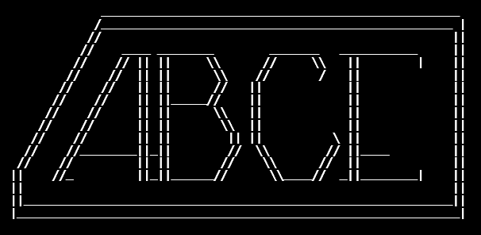

[](https://github.com/biegelk/abce/actions/workflows/python-app.yml)

<p align="center">
  
</p>

# abce: agent-based capacity expansion modeling

abce is a module to perform agent-based capacity expansion (CE) modeling for electricity market systems. It is designed to be coupled with the A-LEAF software tool (by Argonne National Laboratory).

#### Contents
* [Installation](#installation)
  - [Linux / MacOS / Windows Subsystem for Linux](#linux--macos--windows-subsystem-for-linux)
  - [Windows 10](#windows-10)
  - [Optional, Argonne only: installing with A-LEAF](#optional--argonne-only-installing-with-a-leaf)
  - [Optional: installing with CPLEX](#optional-installing-with-cplex)
* [Usage](#usage)
* [Contributing](#contributing)
* [Testing](#testing)
* [License](#license)

## Installation

### Linux / MacOS / Windows Subsystem for Linux

1. Clone this repository to your local machine:

    `git clone https://github.com/biegelk/abce`

2. If using A-LEAF, see the optional [Installing with A-LEAF](#optional--argonne-only-installing-with-a-leaf) section below. Currently, only users with Argonne gitlab credentials can use A-LEAF, but a public release is coming soon!

3. If using CPLEX, see the optional [Installing with CPLEX](#optional-installing-with-cplex) section below

4. Inside your local `abce` directory, run the installation script with:

   `bash ./install.sh`

5. When prompted for the A-LEAF repository, do one of the following:

   * Enter the absolute path to the directory where you cloned A-LEAF, or

   * Press Enter without entering any text, if not using A-LEAF

6. Wait for the installation script to run to completion. Review any errors/issues printed for your reference at the end of execution.

7. Restart your terminal session, or re-source your `.bashrc` file.

8. If using Conda to manage environments, activate the `abce` conda environment with:

   `conda activate abce_env`

9. Rerun the installation script to complete the environment setup:

   `bash ./install.sh`

10. Test it out by running the following within your `abce` directory:

   `python run.py -f`

11. Once the previous command runs to completion without failing, generate a precompiled Julia sysimage file with:

   `julia make_sysimage.jl`


### Windows

1. Download and install [Miniconda](https://docs.conda.io/en/main/miniconda.html)

2. Download and install [Julia 1.8](https://julialang.org/downloads/). Check the box in the installer to add Julia to the PATH.

3. If using A-LEAF, see the optional [Installing with A-LEAF](#optional--argonne-only-installing-with-a-leaf) section below. Currently, only users with Argonne gitlab credentials can use A-LEAF, but a public release is coming soon!

4. If using CPLEX, see the optional [Installing with CPLEX](#optional-installing-with-cplex) section below

5. Using the Anaconda Powershell, clone this repo to your local machine:

   `git clone https://github.com/biegelk/abce`

6. Create the local conda environment:

   `conda env create -f .\environment_win.yml`

7. Activate the `abce_anv` conda environment:

   `conda activate abce_env`

8. Set the `ABCE_DIR` environment variable to the absolute path to your `abce` repo (e.g. `C:\Users\myname\abce`)

9. Test it out by running the following within your `abce` directory:

   `python run.py -f`

10. Once the previous command runs to completion without failing, generate a precompiled Julia sysimage file with:

   `julia make_sysimage.jl`

### Optional / Argonne only: installing with A-LEAF

1. Clone the ABCE A-LEAF repo:

   `git clone git-out.gss.anl.gov/kbiegel/kb_aleaf`

2. Inside the A-LEAF directory, run the A-LEAF environment setup script:

   `julia make_julia_environment.jl`

3. Test the A-LEAF install by running the following within your A-LEAF directory:

   `julia execute_ALEAF.jl`

4. Once the previous command runs to completion without failing, generate a precompiled Julia sysimage file with:

   `julia make_sysimage.jl`

5. Set the `ALEAF_DIR` environment variable to the absolute path to your A-LEAF repo

### Optional: installing with CPLEX

1. Download the [CPLEX (IBM ILOG STUDIO 20.10) binaries](https://www.ibm.com/docs/en/icos/20.1.0?topic=cplex-installing)

2. Run the CPLEX installer, following all instructions.

3. Check that `CPLEX` is installed properly: open the Windows Command Prompt and run the command `$ cplex`. The output should resemble:

```bash
(base) sdotson@research:~$ cplex

Welcome to IBM(R) ILOG(R) CPLEX(R) Interactive Optimizer 20.1.0.0
  with Simplex, Mixed Integer & Barrier Optimizers
5725-A06 5725-A29 5724-Y48 5724-Y49 5724-Y54 5724-Y55 5655-Y21
Copyright IBM Corp. 1988, 2020.  All Rights Reserved.

Type 'help' for a list of available commands.
Type 'help' followed by a command name for more
information on commands.
```

If the cplex command is not found, try adding the absolute path of your cplex executable to the `$PATH` environment variable with

`$ export CPLEX_STUDIO_BINARIES=/opt/ibm/ILOG/CPLEX_Studio201/cplex/bin/x86-64_linux/`

`$ export PATH=$PATH:$CPLEX_STUDIO_BINARIES`


## Usage

`abce` is invoked by the command:

  `python run.py`

run from the top level of the local `abce` directory. This command can accept several optional arguments:

  * `-f`: automatically agree to overwrite any existing database and output files.

  * `--verbosity=k`, where k takes one of the following values:

    * 0: completely silent execution

    * 1: minimal output to mark progression through timesteps and agent turns only

    * 2 (default): basic output showing sub-steps within agent turns

    * 3: maximally verbose, showing results of many calculations and all DEBUG-level messages

  * `--settings_file=<user_file>`: specify the desired settings file with relative path `<user_file>`. Default: `./settings.yml`

  * `-d`: "demo" mode, pauses execution at the end of each time step to allow the user to review printed outputs


### Use ABCE with `watts`
The[ Workflow and Template Toolkit for Simulations (`watts`)](https://github.com/watts-dev/watts) has an `abce` plugin. Please see the `watts` documentation for usage. This workflow tool is useful for conducting sensitivity analyses and other experiments with `abce`.

## Testing

### Python Unit Tests

Python tests may be run with `pytest` in the top-level directory.

### Integration Tests

These tests run a complete scenario to verify a working installation.

#### HiGHS Solver
The HiGHS solver is an open-source solver competitive with commercial solvers and much faster than common open-source solvers such as `GLPK` and `Cbc`. To run the `HiGHS` test case:

```bash
$ python run.py -f --settings-file=./test/highs_settings.yml
```
This command should produce the following output.
```bash
>>>(base) C:\Users\samgd\Research\argonne\abce>python run.py -f
Using ATB Year 2020
Existing file at C:\Users\samgd\Research\argonne\abce\solver_test.db deleted.       
Creating a new database file at C:\Users\samgd\Research\argonne\abce\solver_test.db.
Database created in file 'C:\Users\samgd\Research\argonne\abce\solver_test.db'.
using specified value: 3
using specified value: 140
WARNING:root:No match (or multiple matches) found for unit type Wind; setting unit_specs value for Fuel to 0.
WARNING:root:No match (or multiple matches) found for unit type Solar; setting unit_specs value for Fuel to 0.
WARNING:root:No sysimage file found at C:\Users\samgd\Research\argonne\abce\dispatch.so. Execution will proceed, but the dispatch
sub-module may run extremely slowly. If you already have a dispatch sysimage file, please move it to the filename 
{dispatch_sysimage_path}. If you do not have a dispatch sysimage file, please run 'julia make_sysimage.jl --mode=dispatch' in this 
directory.
Start ALEAF scenario reduction algorithm!
==== DONE ! ================================
Agent #202 is taking its turn...
[ Info: Solver is `highs`
Agent #202's turn is complete.

Agent #201 is taking its turn...
[ Info: Solver is `highs`
Agent #201's turn is complete.


All agent turns are complete.

Table of all assets:
Start ALEAF scenario reduction algorithm!
==== DONE ! ================================
Agent #201 is taking its turn...
[ Info: Solver is `highs`
Agent #201's turn is complete.

Agent #202 is taking its turn...
[ Info: Solver is `highs`
Agent #202's turn is complete.


All agent turns are complete.

Table of all assets:
```


## License
Copyright 2022 Argonne National Laboratory

Licensed under the Apache License, Version 2.0 (the "License");
you may not use this file except in compliance with the License.
You may obtain a copy of the License at

    http://www.apache.org/licenses/LICENSE-2.0

Unless required by applicable law or agreed to in writing, software
distributed under the License is distributed on an "AS IS" BASIS,
WITHOUT WARRANTIES OR CONDITIONS OF ANY KIND, either express or implied.
See the License for the specific language governing permissions and
limitations under the License.
